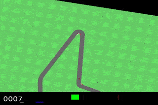
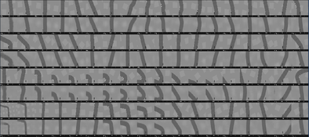

# Carracing Dreamer

Solving the car racing problem in OpenAI Gym using Dreamer.

Paper: https://arxiv.org/abs/1912.01603  
Project Website: https://danijar.com/project/dreamer/
TensorFlow 2 implementation: https://github.com/danijar/dreamer  
TensorFlow 1 implementation: https://github.com/google-research/dreamer  

PyTorch implementation: https://github.com/juliusfrost/dreamer-pytorch
Car Racing with PyTorch: https://github.com/xtma/pytorch_car_caring

## Todo

- [ ] Global prior
- [ ] Observation overshooting
- [ ] Latent overshooting
- [ ] Discount network
- [ ] Categorical reward
- [ ] Evaluation phase
- [ ] Multi-process env

